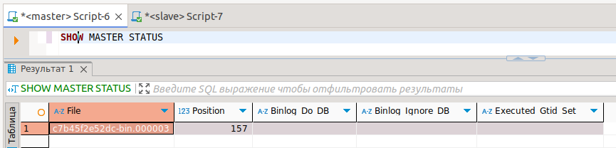
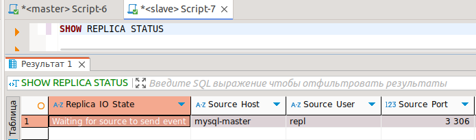
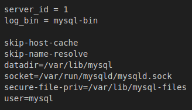
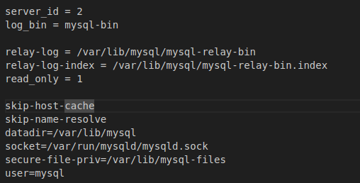
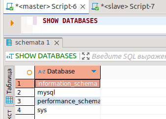
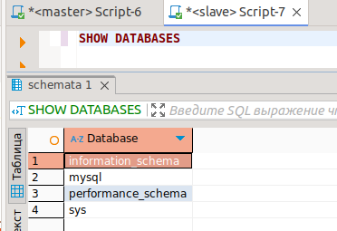
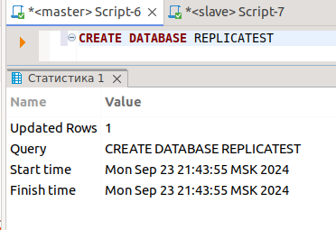
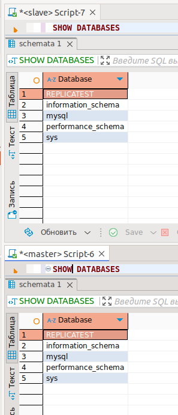

# Домашнее задание к занятию «Репликация и масштабирование. Часть 1» - Жаринов Павел

### Задание 1

На лекции рассматривались режимы репликации master-slave, master-master, опишите их различия.

```
Репликация - это механизм копирования и распространения данных и объектов баз данных между базами данных, а также синхронизации баз данных для поддержания согласованности, масштабирования и отказоустоичивости.

master-slave
Используется для отказоустойчивости, распределения нагрузки, резервного копирования. Master - основной сервер БД. Все изменения в БД должны происходить на нём. Slave - вспомогательный сервер БД, на который реплицируются все данные с основного сервера БД. Используется для чтения данных.

master-master
В отличии от репликации master-slave репликация master-master происходить в обе стороны, т.е. каждый сервер БД является и мастером и слейвом единовременно, что повышает доступность и скорость.
```

---

### Задание 2

Выполните конфигурацию master-slave репликации, примером можно пользоваться из лекции.

*Приложите скриншоты конфигурации, выполнения работы: состояния и режимы работы серверов.*









